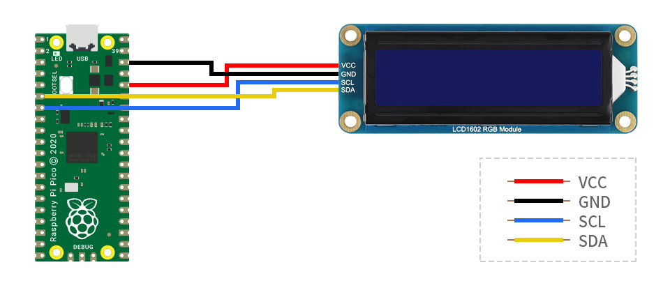

# MicroPython 16x2 LCD Screen (I2C)

This library is designed to support a MicroPython interface for I2C 16x2 LCD character screens.

## Tested LCDs

- [Grove LCD RGB Backlight](https://www.seeedstudio.com/grove-lcd-rgb-backlight-p-1643.html?cPath=34_36)
- [Waveshare 1602 RGB Backlight](https://www.waveshare.com/wiki/LCD1602_RGB_Module)

## Tested Boards

- Raspberry Pi Pico

## Wiring



## Example Code

```python
import i2c_lcd
from machine import I2C

i2c = I2C(0)
d = i2c_lcd.Display(i2c)

# Clear the screen
d.clear()

# Write "Hello World" to the screen
d.write("Hello World")

# Move the cursor to the top left corner
d.move(0, 0)

# Set the backlight to red
d.color(255, 0, 0)
```

## Library API

This module supports writing to, clearing and refreshing the LCD screen, among other functions.

### write(text)

Prints text to LCD screen at the location of the cursor.

### autoscroll(bool)

Enables lcd to scroll text as typed.

### cursor(bool)

Sets cursor visibility.

### blink(bool)

Sets blink visibility.

### display(bool)

Sets display state (on/off).

### home()

Returns the cursor to the (0,0) location on screen

### move(col, row)

Moves the cursor to (col,row)

### color(r, g, b)

Changes the color of the LCD Backlight to (r,g,b)
