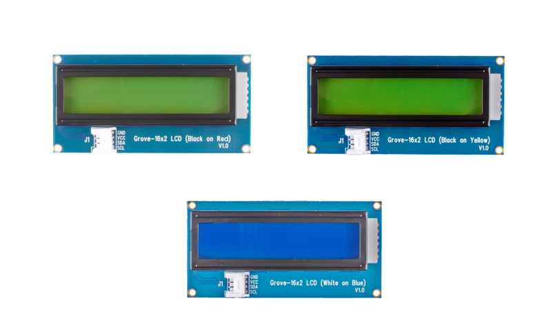

# MicroPython I2C 16x2 LCD Screen

This library is designed to support a MicroPython interface for i2c LCD character screens. It's designed around the Pycom implementation of MicroPython so will need to be tweaked to work for CircuitPython.

## Compatible Displays


[Grove LCD RGB Backlight](https://wiki.seeedstudio.com/Grove-LCD_RGB_Backlight/)


[Grove LCD](https://wiki.seeedstudio.com/Grove-16x2_LCD_Series/)

## Tested Dev Kits

- LoPy
- WiPy
- SiPy
- Arduino Nano RP2040 Connect

## Module

This module supports writing to, clearing and refreshing the LCD screen, among other functions.

### write(text)

Prints text to LCD screen at the location of the cursor.

### autoscroll(bool) [CURRENTLY NOT WORKING]

Enables lcd to scroll text as typed.

### cursor(bool)

Sets cursor visibility.

### blink(bool)

Sets blink visibility.

### display(bool)

Sets display state (on/off).

### home()

Returns the cursor to the (0,0) location on screen

### move(col, row)

Moves the cursor to (col,row)

### color(r, g, b)

Only supported by Displays with RGB Backlight.
Changes the color of the LCD Backlight to (r,g,b)

To use the Grove RGB Display you will need to initialize the Display object
using also the address of the RGB Backlight module

```
from i2c_lcd import RGBDisplay
my_display = RGBDisplay(i2c_bus, 0x3e, 0x62)
```


